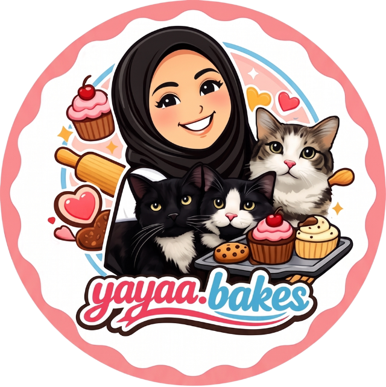

<div align="center">
  
  <h1>Yayaa.Bakes POS</h1>
  <p><strong>Micro-POS & Inventory Tracker</strong> — purpose-built for small dessert businesses</p>

  
  
  
  
  
  
</div>

---

## Overview

A lightning-fast, mobile-first POS system for **Yayaa.Bakes** — a home-based dessert brand run by a hijabi baker and her three cats. Built as a PWA that feels like a native app, with offline-first mock data and optional Supabase sync.

### Core Features

| Feature | Description |
|---|---|
| **Counter Checkout** | Visual grid grouped by category (Sweet Treats / Soft Cookies). Tap to add to cart buffer — no stock deducted until sale confirmed |
| **Smart Cart** | Collapsible bottom sheet with quantity controls, total display, and quick clear |
| **Dual Payment** | Cash (with cat-ear confirmation modal) or DuitNow QR (displays QR code for customer scan) |
| **Inventory Safeguard** | Cat-ear confirmation modal before finalizing any sale. RECEIVED saves to DB + deducts stock. CANCEL aborts with zero changes |
| **Waste / Freebie** | Long-press (800ms) any product card → log as wasted or freebie (deducts 1 from stock, RM 0.00 sale) |
| **Product Management** | Add / edit / delete products with camera-or-gallery image upload (auto-compressed to 96×96px JPEG ~2KB) |
| **Session Modal Tracking** | Log operating costs per session. Accumulates across days/weeks/months for accurate profit calculation |
| **EOD Reconciliation** | Today / This Week / This Month tabs with gross sales, payment split, category breakdown, AOV, net profit, and low-stock alerts |
| **PIN Lock** | 4-digit PIN protects admin tabs (Products + Summary). Forgot PIN? → resets and lets you create a new one |
| **Multi-Tenant** | Supabase RLS isolates every table by `store_id`. One schema, unlimited stores |

---

## Screens

| Counter | Payment | Summary |
|---|---|---|
| Product grid with cart badge, low-stock alerts, and section headers | Cash / DuitNow QR modal with total display | Period tabs, quick stats, payment split, category bars, low-stock alerts |

---

## Tech Stack

- **Framework:** Next.js 14 (App Router, static export)
- **UI:** React 18 + Tailwind CSS 3 + Lucide Icons
- **Database:** Supabase (PostgreSQL) with row-level security
- **State:** React Context + useReducer (cart), useState (checkout flow)
- **PWA:** Web manifest, standalone display, iOS splash screen ready
- **Image Compression:** Canvas-based resize → base64 data URL (no storage bucket required)

---

## Quick Start

```bash
# 1. Clone
git clone https://github.com/HaikalTDM/Yayaa.BakesPos.git
cd Yayaa.BakesPos

# 2. Install
npm install

# 3. Run (mock mode — works offline, no Supabase needed)
npm run dev
```

The app opens at `http://localhost:3000` with 6 pre-loaded products and 30 days of mock sales data.

---

## Supabase Setup (optional)

<details>
<summary>Click to expand — connect to a real database</summary>

1. **Run the schema** — open Supabase SQL Editor and paste the entire `schema.sql`. It creates all tables, RLS policies, functions, and seed data.

2. **Copy your store ID** — the last SELECT in `schema.sql` prints your store UUID.

3. **Configure `.env.local`**:

```env
NEXT_PUBLIC_SUPABASE_URL=https://your-project.supabase.co
NEXT_PUBLIC_SUPABASE_ANON_KEY=eyJhbGciOi...
NEXT_PUBLIC_STORE_ID=your-store-uuid-from-step-2
```

4. **Restart** — `npm run dev`

</details>

---

## Database Schema

```
stores ────────────── multi-tenant root
  │
  ├── products ────── id, store_id, name, price, stock, image_url, category
  ├── sales ───────── id, store_id, total, payment_method, status
  │     └── sale_items ── id, sale_id, product_id, quantity, price_at_sale
  ├── inventory_logs  id, store_id, product_id, change_amount, reason, sale_id
  └── session_modals  id, store_id, amount, note
```

All tables protected by RLS — `store_id` isolation at the database level.

---

## Project Structure

```
src/
├── app/
│   ├── layout.tsx          PWA metadata, viewport lock, theme
│   ├── page.tsx            Main orchestrator — tabs, cart flow, PIN gate
│   └── globals.css         Tailwind directives, mobile optimizations
├── components/
│   ├── ProductCard.tsx     Grid card with cart badge + long-press
│   ├── ProductGrid.tsx     Category-grouped product grid
│   ├── CartPanel.tsx       Collapsible bottom-sheet cart
│   ├── PaymentButtons.tsx  Cash / DuitNow payment modal
│   ├── CheckoutModal.tsx   Cat-ear confirmation modal
│   ├── QR modal (inline)   DuitNow QR display with PAID/DONE
│   ├── LongPressPopup.tsx  Waste / freebie action popup
│   ├── ReconciliationDashboard.tsx  Period stats + modal tracking
│   ├── ProductManager.tsx  CRUD with image upload
│   ├── PinEntry.tsx        PIN unlock modal + forgot PIN flow
│   ├── PinSetup.tsx        First-time PIN creation
│   └── TabBar.tsx          Counter / Summary / Products tabs
├── hooks/
│   ├── useCart.tsx         Cart context + useReducer
│   ├── useLongPress.ts     Pointer-based long-press (800ms)
│   └── usePinLock.tsx      PIN lock context with localStorage
└── lib/
    ├── types.ts            All TypeScript types
    ├── supabase.ts         Supabase client + store context init
    ├── db.ts               CRUD operations + mock fallback
    └── image.ts            Canvas-based image compressor
```

---

## Brand

| Token | Hex | Usage |
|---|---|---|
| Primary Pink | `#E8577A` | Buttons, active states, accent bars |
| Background | `#FFFAF2` | Main app background |
| Text | `#3D2C2A` | Headings, labels |
| Slate | `#1E293B` | Summary dashboard cards |

---

## License

MIT — built with love for Yayaa.Bakes 🐱
